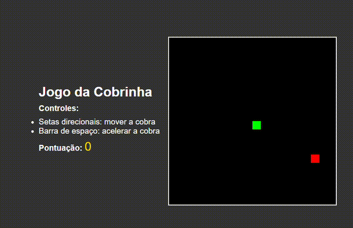

# Jogo da Cobrinha 🐍

Este é um simples **jogo da cobrinha** desenvolvido com **HTML**, **CSS**, e **JavaScript**. O objetivo do jogo é controlar uma cobra que cresce ao comer maçãs, enquanto evita colidir com as bordas do campo ou com seu próprio corpo. O jogo inclui aceleração da cobra ao pressionar a barra de espaço, pontuação, e controles baseados nas setas direcionais do teclado.

## 🎮 Demonstração

  
_(Gif ilustrativo)_

## 📋 Funcionalidades

- Movimentação da cobra com as **setas direcionais**.
- Aceleração da cobra ao segurar a **barra de espaço**.
- A cobra cresce ao comer uma maçã, e a pontuação aumenta.
- O jogo reinicia quando a cobra colide com as bordas ou com seu próprio corpo.
- Instruções de controle e exibição da pontuação ao lado da área de jogo.

## 🚀 Como executar o projeto

Siga estas instruções para configurar e executar o jogo localmente:

### 1. Clone o repositório

Clone o repositório do projeto para sua máquina local:

```bash
git clone https://github.com/seu-usuario/jogo-da-cobrinha.git
```

### 2. Acesse o diretório do projeto

```bash
cd jogo-da-cobrinha
```

### 3. Abra o arquivo `index.html` em seu navegador

Você pode abrir o arquivo diretamente no navegador:

- No Windows: clique duas vezes no arquivo `index.html` no diretório do projeto.
- No macOS/Linux: abra o arquivo no navegador via linha de comando:

```bash
open index.html   # macOS
xdg-open index.html  # Linux
```

## 🕹️ Como jogar

- **Setas direcionais**: Mover a cobra nas direções esquerda, direita, cima, e baixo.
- **Barra de espaço**: Acelerar a cobra enquanto pressionada.
- O objetivo é **comer as maçãs** para ganhar pontos e evitar colidir com as bordas ou com seu próprio corpo.

## 📄 Estrutura do Projeto

```plaintext
/
├── index.html    # Página principal contendo o canvas e a interface do jogo
├── style.css     # Arquivo de estilos para o layout e design do jogo
├── script.js     # Arquivo de lógica do jogo em JavaScript
└── README.md     # Este arquivo com informações sobre o projeto
```

## 🔧 Tecnologias Utilizadas

- **HTML5**: para a estrutura da página e o `canvas` onde o jogo é renderizado.
- **CSS3**: para a estilização da interface do jogo e da página.
- **JavaScript**: para a lógica do jogo, incluindo movimentação da cobra, colisão e pontuação.

## 📚 Aprendizado

Este projeto é ótimo para entender conceitos básicos de desenvolvimento web, incluindo:

- Manipulação de elementos gráficos usando o **Canvas** em HTML.
- Controle de jogo e animação com **JavaScript**.
- Estilização básica de interface com **CSS**.
- Implementação de lógica de jogo (movimento, colisão, pontuação).

## 📝 Contribuições

Sinta-se à vontade para contribuir com o projeto! Faça um **fork** do repositório, adicione suas melhorias e envie um **pull request**.

1. Faça um **fork** do projeto.
2. Crie uma nova branch com a sua funcionalidade: `git checkout -b minha-nova-funcionalidade`.
3. Faça o commit das suas alterações: `git commit -m 'Adiciona nova funcionalidade'`.
4. Envie para a branch: `git push origin minha-nova-funcionalidade`.
5. Abra um **pull request**.

## 📜 Licença

Este projeto é de código aberto e está licenciado sob a [MIT License](https://opensource.org/licenses/MIT).
